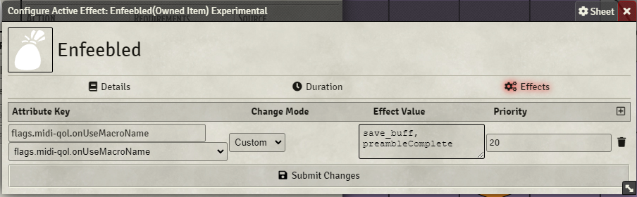

# Usage

A series of items to make any saves imposed by an actor be made at advantage.

Import the macro: `save_buff` into a global macro and add the the item `Save Buff` to desired actor. 

These can be used manually by calling the `save_buff` macro from the item's OnUseMAcro and setting it to be called `After targeting complete`.

These can also be combined into an effect as shown in the example `Enfeebled` feature which applies an effect which forces all imposed saves to be made at advantage.

The particulars of the effect are unimportant the only important part of the set up the duration: `Expires if the character rolls: saving throw` and the effect's effects as shown in the picture below. 

Should these be copied this functionality can be added to any effect on any item.

