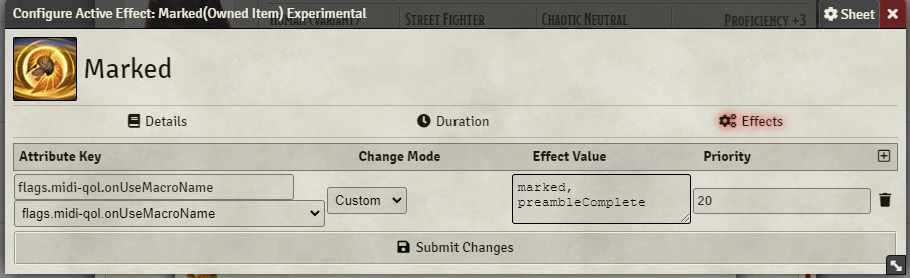

# Description

### Goading Challenge

In 5th edition, there are few ways for melee characters to control the ebb and flow of the battlefield. This variant allows them to force an enemy to focus upon them, at the same time giving their fellow party members a chance to escape the havoc of the battle.

As a bonus action, you may reduce your speed to 0 until the end of the current turn and force an adjacent target you have hit this turn with a melee weapon attack to make a Wisdom save with a DC equal to 8 + your proficiency modifier + the ability score modifier which you used to make the attack. On a failed save, the target is marked by you, and creatures other than you gain advantage on saving throws against the creature's abilities unless you are also targeted or within their area of effect until the start of your next turn.

### Marked

Creatures that have been marked find it difficult to attack those that did not mark them. A marked creature has disadvantage on attack rolls that do not target the creature that has marked them and creatures other than you gain advantage on saving throws against the creature's abilities unless you are also targeted or within their area of effect until the start of your next turn. If two or more creatures mark the same target, the target does not have disadvantage to attack any of them and saving throws imposed on both are made as flat rolls (though it does have disadvantage to attack any creature that has not marked it).

Created by Ghostwheel#0698

# Usage

Import the `marked` and `save_buff` macros as a global macros.

The only requirement for any item/ feature/ spell that wishes to mark needs to have an effect with the changes as shown in the picture below, the rest of the effect (duration, etc.) can be setup as desired:

