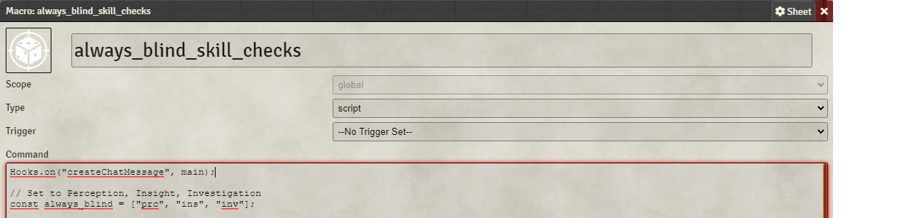

# Usage

World Script to make certain social rolls always be blind regardless of player settings.

To use simply add the script to your world as a world script.
The `World Scripter` Macro WILL work in this case.

# Choosing Which Skills

By default the macro applies to all Perception, Investigation and Insight checks.

The script can be edited to include other skills by editing the `always_blind` array, shown in the picture, to include the abbreviations (found in the table provided) of the desired skills following the format that is established already. 

| Skill           | Abreviation |
|-----------------|-------------|
| Acrobatics      | acr         |
| Animal Handling | ani         |
| Arcana          | arc         |
| Athletics       | ath         |
| Deception       | dec         |
| History         | his         |
| Insight         | ins         |
| Intimidation    | itm         |
| Investigation   | inv         |
| Medicine        | med         |
| Nature          | nat         |
| Perception      | prc         |
| Performance     | prf         |
| Persuasion      | per         |
| Religion        | rel         |
| Sleight of Hand | slt         |
| Stealth         | ste         |
| Survival        | sur         |

