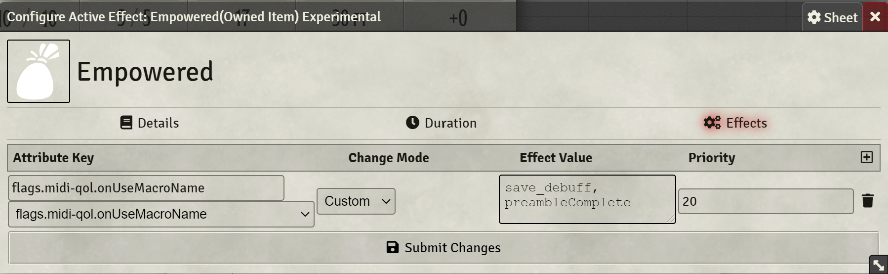

# Usage

A macro to make any saves imposed by an actor be made at disadvantage.

Import the macro: `save_debuff` as global macro. 

This can be used manually by calling the `save_debuff` macro from an item's OnUseMacro and setting it to be called `After targeting complete` or any event prior to that. As shown with the `Strong Fireball` example item.

These can also be combined into an effect as shown in the example `Empowered` feature which applies an effect which forces all imposed saves to be made at disadvantage.

The particulars of the effect are unimportant the only important part of the set up are the effect's changes as shown in the picture below. 

Should these be copied this functionality can be added to any effect on any item or any item/feature/spell.

