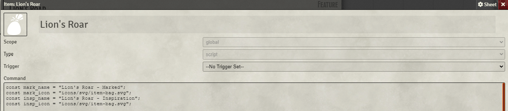
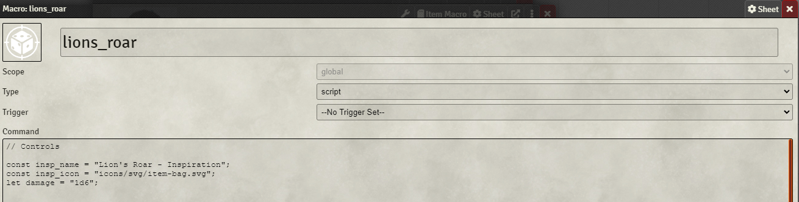
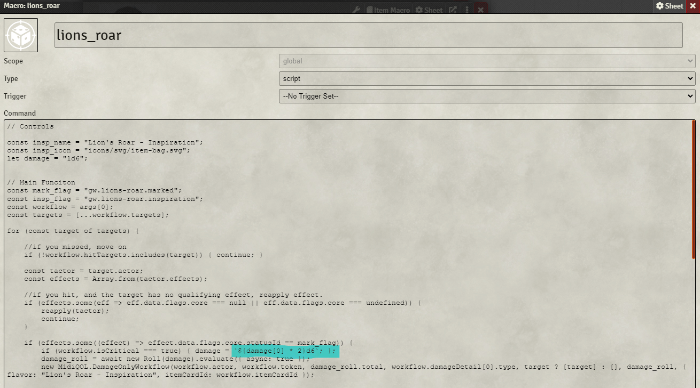

# Description

### Lion's Roar (Novice, Strike, Prowess)
    
*As you strike a foe you unleash a howl that exhilarates and inspires your allies.*

Make an melee weapon attack; if you hit, you deal your normal damage and 2d6 additional damage.
In addition, if you hit, the first successful attack that each ally makes against the target deals 1d6 additional damage until the start of your next turn.

Created by Ghostwheel#0698

---

# Usage

This version seeks to reduce the clutter to character sheets but has the draw back of being more dificult to customise

Steps:
 - import `lions_roar` macro as a global macro
 - import Lion's Roar item

To use, Activate the `Lion's Roar` feature and then make a weapon attack.

# Notes on Customisation

Since all the actors which use this will go through the `lions_roar` global macro, the effect image of "Inspiration" will be the same across all users of the effect on reaplication.

In the `Lion's Roar` Item Macro

The following fields found at the top of the macro control the NAME and EFFECT IMAGES of the produced effect, where mark is applied to the target and insp to 'allies.'

#### NOTE:
 the "Inspiration" effect is also applied via the macro and so the settings for name and image should be identical for consistency, though they do not need to be for function.

In the `lions_roar` macro:

The "Inspiration" effect's name and effect image must once again be set here as noted above. The bonus damage can also be changed here into any dice string foundry will accept.

#### NOTE:
 The check performed to edit the damage string for a critical hit relies on the first character being a number i.e. complicated dice strings involving parentheses - `()` or braces - `{}` will require the section highlighted in the image below to reflect the correct critcal damage. 

## Minor technical details

`Lion's roar - Inspiration` is applied to all tokens on the current canvas which have have a player owner using Foundry's 'acto.hasPlayerOwner' field. According to my testing the buff will apply to NPCs with player owners like pets, etc. This may not be intended behaviour and may cause slowdown if there are alot of player owned tokens on a map. 

I have no current plans for "fixing" this. 
